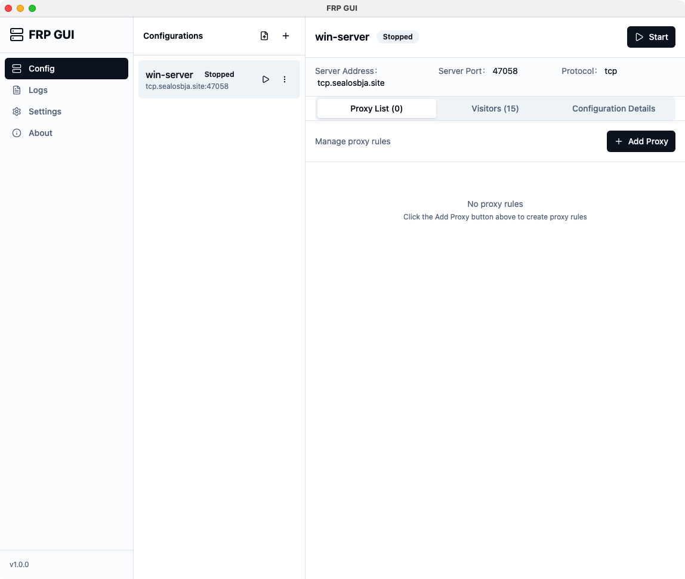
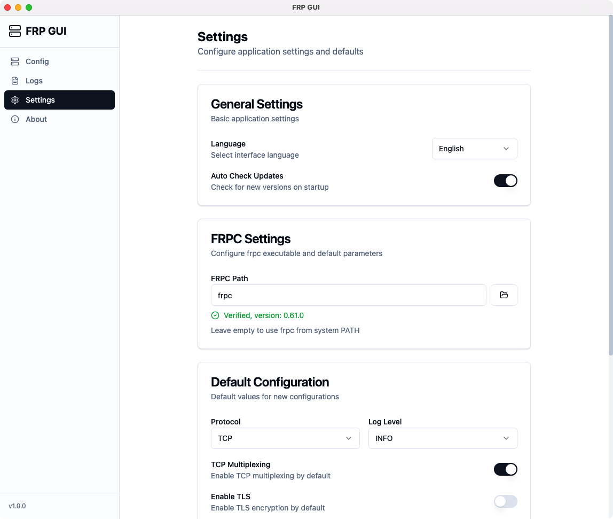
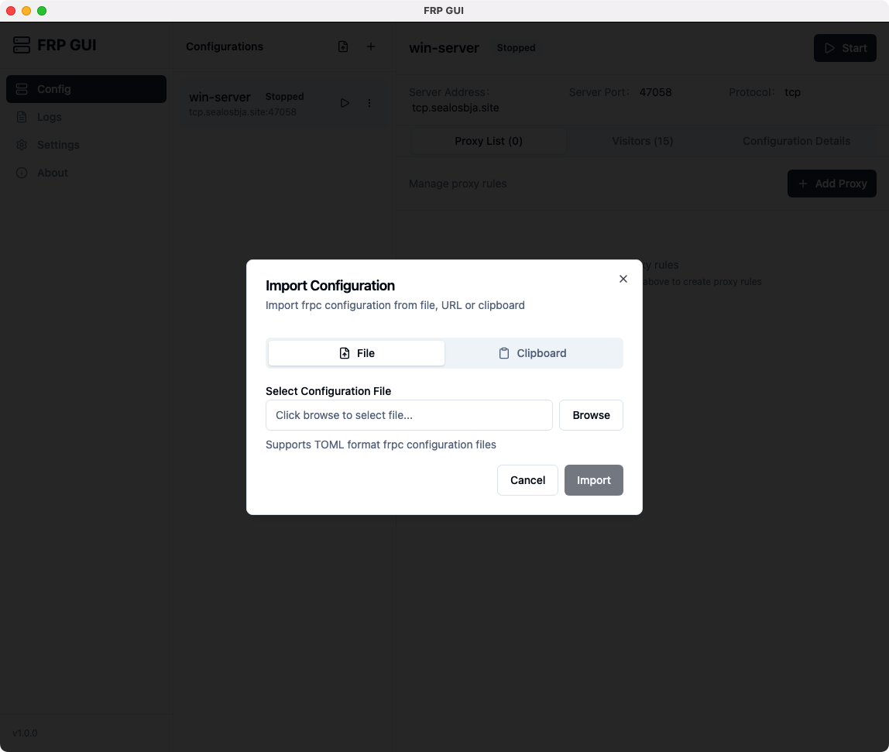
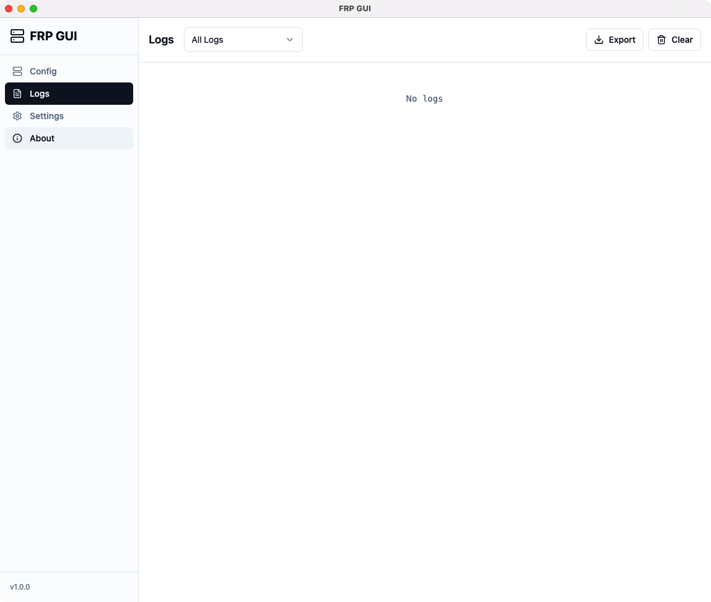

# FRPC GUI

<div align="center">

**跨平台 FRP 客户端 GUI 管理工具**

一个现代化、用户友好的 GUI 应用程序，用于在多个平台上管理 FRP (Fast Reverse Proxy) 客户端。

[](https://github.com/hidumou/frpc-gui/releases)
[](LICENSE)
[](https://github.com/hidumou/frpc-gui/releases)
[](https://github.com/hidumou/frpc-gui/stargazers)
[](https://github.com/hidumou/frpc-gui/issues)

[English](./README.md) | [简体中文](./README_zh-CN.md)

</div>

## 特性

- **跨平台支持**：支持 macOS、Windows 和 Linux
- **直观的仪表盘**：通过可视化界面管理所有 FRP 隧道
- **轻松配置**：使用简洁的界面导入和管理 FRP 配置
- **实时日志**：通过内置日志查看器监控 FRP 客户端活动
- **灵活设置**：自定义 FRP 服务器设置和客户端选项
- **TOML 支持**：原生支持 FRP TOML 配置文件

## 截图

### 仪表盘
在一个地方管理和监控所有 FRP 隧道


### 设置
配置 FRP 服务器连接和客户端设置


### 导入配置
轻松导入现有的 FRP 配置文件


### 日志查看器
查看来自 FRP 客户端的实时日志


## 安装

### 下载预编译二进制文件

你可以从 [发布](https://github.com/hidumou/frp-gui/releases) 页面下载最新版本。

- **macOS**：下载 `.dmg` 或 `.zip` 文件
- **Windows**：下载 `.exe` 安装程序或 `.zip` 压缩包

### 从源代码构建

```bash
# 克隆仓库
git clone https://github.com/hidumou/frp-gui.git
cd frp-gui

# 安装依赖
pnpm install

# 构建应用
pnpm electron:build
```

构建的应用程序将在 `release` 目录中。

## 使用方法

1. **启动应用程序**：安装后打开 FRPC GUI
2. **配置服务器**：在设置中添加你的 FRP 服务器地址和端口
3. **导入配置**：导入现有的 `frpc.toml` 配置文件
4. **启动隧道**：从仪表盘启用和管理隧道
5. **监控日志**：查看实时日志以排查任何问题

## 开发

```bash
# 安装依赖
pnpm install

# 启动开发服务器
pnpm dev

# 构建生产版本
pnpm build
```

## 系统要求

- **Node.js**：>= 18.0.0
- **pnpm**：>= 8.0.0

## 技术栈

- **Electron**：跨平台桌面应用框架
- **React**：UI 库
- **Vite**：构建工具和开发服务器
- **TypeScript**：类型安全的 JavaScript
- **Tailwind CSS**：实用优先的 CSS 框架
- **Radix UI**：无障碍 UI 组件库
- **i18next**：国际化框架

## 许可证

MIT 许可证 - 详见 [LICENSE](LICENSE) 文件

## 贡献

欢迎贡献！请随时提交 Pull Request。

## 支持

如果你遇到任何问题或有疑问，请在 GitHub 上 [提交 issue](https://github.com/hidumou/frp-gui/issues)。

## 致谢

- [FRP](https://github.com/fatedier/frp) - 快速反向代理
- [Electron](https://www.electronjs.org/) - 跨平台桌面框架
